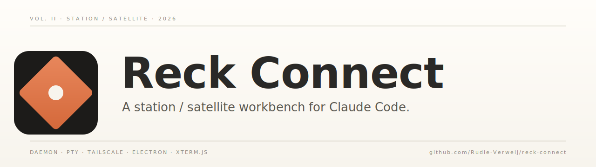
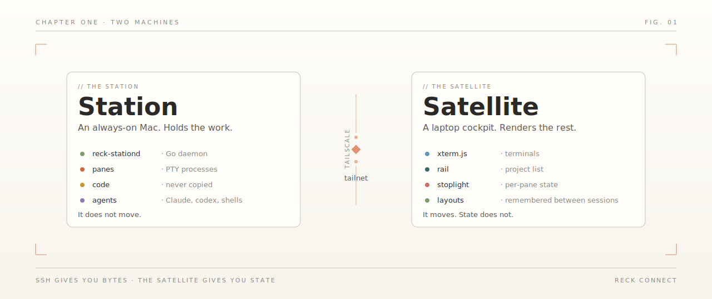
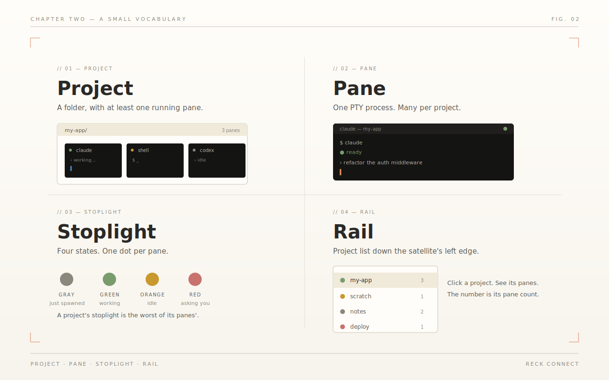
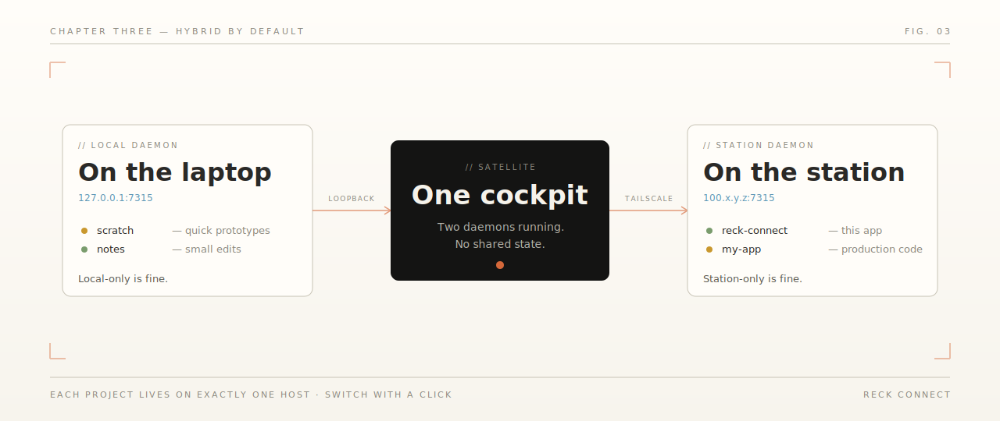
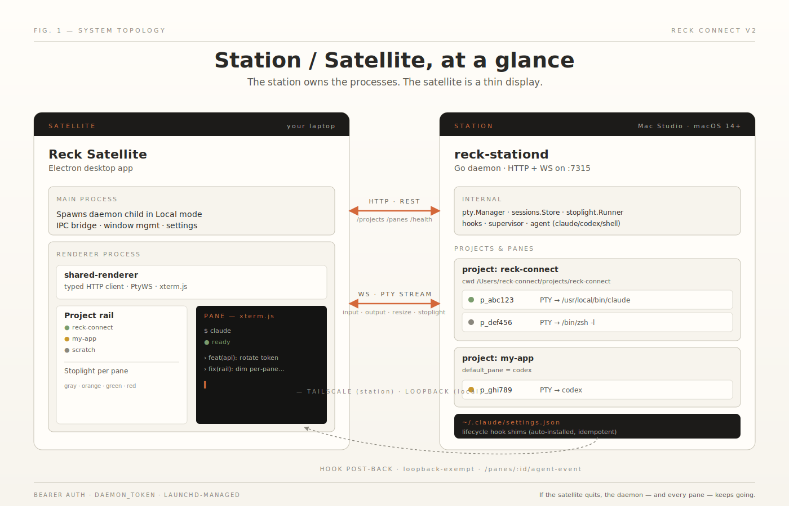

<picture>
  <source media="(prefers-color-scheme: dark)" srcset="docs/assets/banner-dark.svg">
  
</picture>

 

<i>Built on the always-on Mac. Driven from a laptop. Edited where the work happens.</i>

  

  
  
  
  

---

// 01 &nbsp;—&nbsp; the idea

## A workbench in two parts

Most developers code on a laptop. Some have a beefier Mac at home or in the office and would, given the choice, do the work there. ssh and tmux do half the job. They cannot show what an agent is up to. Remote desktop is laggy. File sync is a series of small heartbreaks.

Reck Connect splits a development environment into two machines that know each other. The **station** is the one that does the work: code, shells, agents, files. The **satellite** is a thin laptop cockpit that renders all of it live over your tailnet. The code never leaves the station.

Close the laptop. Catch a flight. Open it in a hotel. Every pane is exactly where you left it.

---

// 02 &nbsp;—&nbsp; station and satellite

## Two machines. *One* of them does not move.

<picture>
  <source media="(prefers-color-scheme: dark)" srcset="docs/assets/station-satellite-dark.svg">
  
</picture>

The **station** is an always-on Mac. It runs `reck-stationd`, a Go daemon that owns every PTY (terminal process), spawns Claude Code and shells, and serves them over HTTP and WebSocket. The station holds the code, the shells, the running agents, the files.

The **satellite** is a desktop app you run on a laptop. It connects to the station's daemon over Tailscale, renders panes via xterm.js, and shows you the project list, the agent state, and a small running stoplight per pane. Nothing on the satellite outlives a quit. The state is on the station.

The split is the point. ssh gives you bytes. The satellite gives you state.

---

// 03 &nbsp;—&nbsp; what you get

## Three things, in plain terms

1. **Pick up where you left off, anywhere.** Quit the satellite. Open it in another timezone. Every pane, every project, every running agent, in the place you left them.
2. **See what the agent is up to.** A small dot turns green when Claude is working, orange when it pauses, red when it asks for permission. You don't alt-tab to find out.
3. **The code stays where it lives.** Files don't sync, don't replicate, don't drift. The station holds them; the satellite reads.

---

// 04 &nbsp;—&nbsp; concepts

## A small vocabulary

<picture>
  <source media="(prefers-color-scheme: dark)" srcset="docs/assets/concepts-dark.svg">
  
</picture>

- **Project.** A folder with at least one running pane.
- **Pane.** A single PTY process. Could be a Claude Code session, a shell, a codex CLI. You can have many per project.
- **Stoplight.** A four-state dot per pane. Gray when it spawned and is quiet, green when bytes are flowing, orange when it has gone idle, red when it is asking you something. The project's stoplight is the worst of its panes', which is honest.
- **Rail.** The project list down the left edge of the satellite. Click a project, see its panes.

There is also a **Mission Control** pane, a Claude that talks to your other Claudes. Not required. Sometimes useful.

---

// 05 &nbsp;—&nbsp; hybrid mode

## Hybrid by default

<picture>
  <source media="(prefers-color-scheme: dark)" srcset="docs/assets/hybrid-mode-dark.svg">
  
</picture>

The satellite runs two daemons at the same time. One on the laptop, on `127.0.0.1:7315`. One on the station, over Tailscale on `:7315`. Each project lives on exactly one host; you switch focus by clicking. There is no shared state to confuse.

Local-only is fine on a single Mac. Station-only is fine when the laptop is just a viewer. The default is both. See [`docs/concepts/modes.md`](docs/concepts/modes.md).

---

// 06 &nbsp;—&nbsp; status

## Early access. Currently private.

This is a maintainer's daily-driver project. It's hardened on one specific setup and has not been tested across the spread of macOS versions, hardware, and tailnet configurations a wider audience would bring. The repository is currently private; access is invite-only while the install flow stabilises. Treat anything you see here as "works for the maintainer; may surprise you."

A reckoning, eventually. Not yet.

---

// 07 &nbsp;—&nbsp; install

## Install

Open Claude Code in any directory and tell it:

> install Reck Connect from github

It clones the repo, reads [`INSTALL.md`](INSTALL.md), and drives both halves of the install (satellite and the station, over Tailscale SSH) end to end. The runbook is also there if you'd rather read it by hand.

---

// 08 &nbsp;—&nbsp; architecture

## Architecture, for the curious

<picture>
  <source media="(prefers-color-scheme: dark)" srcset="docs/assets/architecture-dark.svg">
  
</picture>

| Component | Path | Role |
|---|---|---|
| **`reck-stationd`** | [`daemon/`](daemon/) | Go HTTP + WebSocket server. Spawns and owns PTY panes. Installs Claude Code lifecycle hook shims. |
| **Reck Satellite** | [`satellite/`](satellite/) | Electron desktop app. Renders panes via xterm.js. |
| **client-core** | [`client-core/`](client-core/) | Platform-neutral browser plumbing. |
| **proto** | [`proto/`](proto/) | Hand-maintained TypeScript and Go wire types. |
| **ops** | [`ops/`](ops/) | Station and satellite install scripts, LaunchAgent plists, mount watchdog. |

---

// 09 &nbsp;—&nbsp; tech

## Tech stack

- **Daemon.** Go, [`creack/pty`](https://github.com/creack/pty), [`go-chi/chi`](https://github.com/go-chi/chi), launchd.
- **Satellite.** Electron, TypeScript, xterm.js, vitest.
- **Network.** Tailscale (station mode), HTTP/1.1 plus WebSocket (RFC 6455).
- **Ops.** launchd plist templates, FUSE-T plus sshfs (project mount), `rsync` (project copy).

---

// 10 &nbsp;—&nbsp; license

## License and contributing

Source under **[PolyForm Noncommercial 1.0.0](LICENSE)**. Free to read, run, and modify for noncommercial purposes. Commercial use is not granted.

This repository is the public mirror; active development happens in a separate private repo. Issues and Discussions are off here. Drive-by triage on a maintainer's daily driver does not scale. If something does not work, [`INSTALL.md`](INSTALL.md) lists the recovery paths. The path for reporting security issues lives in [`SECURITY.md`](SECURITY.md).

---

// 11 &nbsp;—&nbsp; docs

## Docs

- [`docs/overview.md`](docs/overview.md) — what Reck Connect is and isn't
- [`docs/architecture.md`](docs/architecture.md) — components, process model, data flow
- [`docs/getting-started.md`](docs/getting-started.md) — install station and satellite, add a project, open a pane
- [`docs/concepts/`](docs/concepts/) — projects, panes, modes, behaviors, stoplight
- [`docs/operations.md`](docs/operations.md) — running the station day to day
- [`docs/troubleshooting.md`](docs/troubleshooting.md) — when things go sideways
- [`docs/internals.md`](docs/internals.md) — daemon internals, image-paste design
